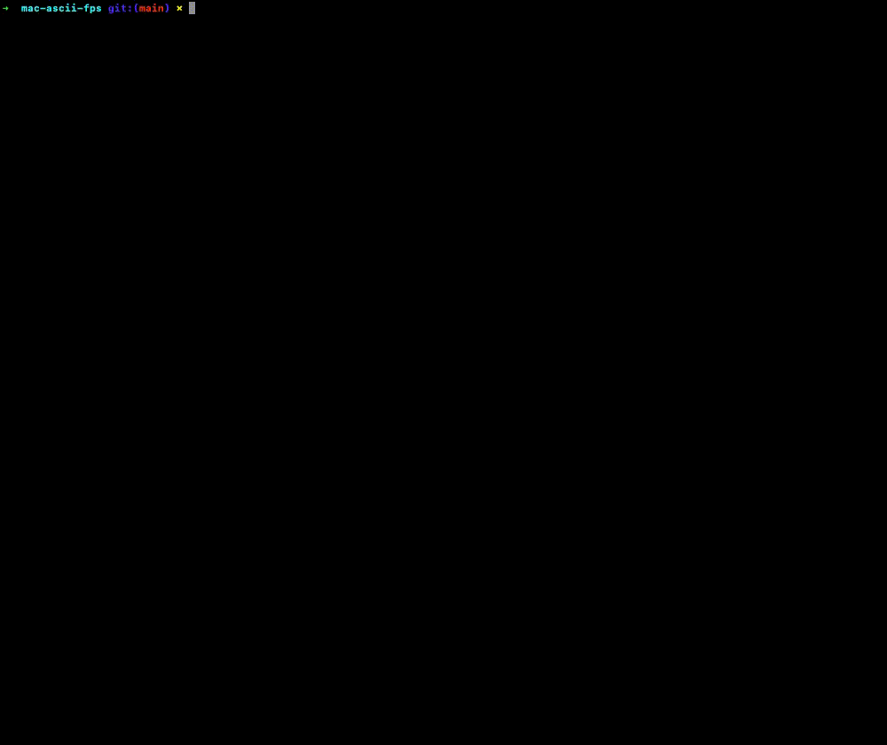

# Unix ASCII FPS
A simulated ASCII first person shooter for UNIX terminals.



## Usage
```
git clone https://github.com/Cookieth/mac-ascii-fps.git
cd mac-ascii-fps
make
```

## Controls

Move around with `w`, `a`, `s`, `d`. `w` and `s` move backwards and forwards, `a`, and `d` rotate.

## Overview
A couple of years ago, I came across this video: https://www.youtube.com/watch?v=xW8skO7MFYw by `javidx9` and I was very intrigued by the ability to render a pseudo-3D environment on a 2D console, with such few lines of code.

However, as a Mac user, I was quite disappointed to find out that the implementation given in the video was heavily dependent on Windows API functions.

This project ports over the same raytracing and rendering logic from the windows version, and makes it compatible with UNIX via the `ncurses` library.

## Resources

- `javidx9`'s FPS for Windows: https://github.com/OneLoneCoder/CommandLineFPS
- ASCII Table for Reference: http://www.asciitable.com/
- `ncurses` Usage Inspired by: https://github.com/k-vernooy/tetris